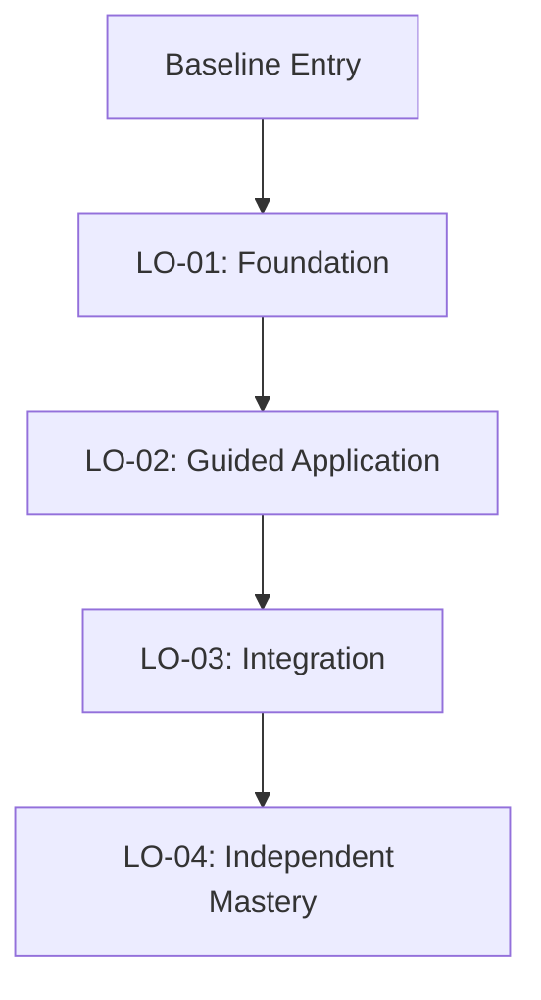

# Stage 8: Learning Progression

Map the sequential trajectory through which learner capability develops from initial exposure to independent mastery.

---

## 1. Pedagogical Progression Hierarchy

Structure the trajectory across five developmental tiers based on cognitive prerequisites:

1. **Prerequisite Verification**: Diagnostic check or activation of prior baseline skills.
2. **Foundational Concepts**: Introducing elementary declarative terms and core mental models.
3. **Intermediate Capabilities**: Building procedural execution through structured, single-skill tasks.
4. **Integrated Capabilities**: Combining multiple concepts and procedures to solve compound challenges.
5. **Advanced / Transfer Performance**: Applying integrated skills autonomously to novel, altered, or complex scenarios.

---

## 2. Standard Progression Patterns

Progressions should reflect empirical instructional design patterns, such as:

$$\mathbf{Demonstration} \longrightarrow \mathbf{Guided\ Practice} \longrightarrow \mathbf{Supported\ Challenge} \longrightarrow \mathbf{Independent\ Performance} \longrightarrow \mathbf{Transfer}$$

> [!CAUTION]
> **Strict Dependency Rule**:
> The progression order must reflect the **actual logical and cognitive dependency** of the concepts, **never** an arbitrary textbook chapter order. An objective must never appear before its prerequisite knowledge is secured.

---

## 3. Required Output Format

```markdown
### 8. Learning Progression

#### Progression Stages
1. **Stage I: Foundations** *(Focus: LO-01)*
   - *Milestone*: [What the learner can do upon completing this stage]
   - *Dependency*: [Entry requirements]
2. **Stage II: Guided Application** *(Focus: LO-02)*
   - *Milestone*: [...]
   - *Dependency*: [Requires Stage I completion]
3. **Stage III: Integration & Troubleshooting** *(Focus: LO-03)*
   - *Milestone*: [...]
   - *Dependency*: [Requires Stage II completion]
4. **Stage IV: Independent Mastery & Transfer** *(Focus: LO-04)*
   - *Milestone*: [...]
   - *Dependency*: [Requires Stage III completion]

#### Dependency Map

